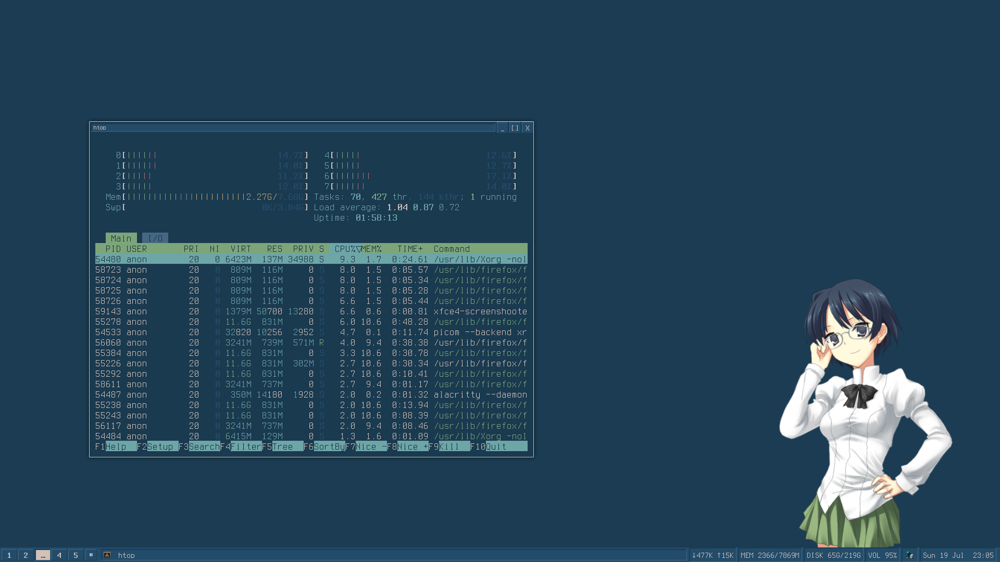

<div align="center">


<h1>AwesomeWM Configuration</h1>

<p><strong>Minimal, clean & performant AwesomeWM setup with Alacritty + Rofi</strong></p>

<br>

[](https://github.com/user7210unix/awesomewm)
[](https://github.com/user7210unix/awesomewm/fork)
[](LICENSE)
[](https://awesomewm.org)
[](https://www.lua.org)

</div>

---

## About

My personal **AwesomeWM** configuration focused on simplicity, speed, and beauty.  
Includes configurations for **Alacritty** and **Rofi**.

## Preview



## Features

- Custom keybindings
- Rofi integration
- Alacritty terminal config
- Easy to customize

## Installation

```bash
# Clone this repo
git clone https://github.com/user7210unix/awesomewm.git ~/.config/awesome

# (Optional) Backup old config
mv ~/.config/awesome ~/.config/awesome.bak 2>/dev/null || true
